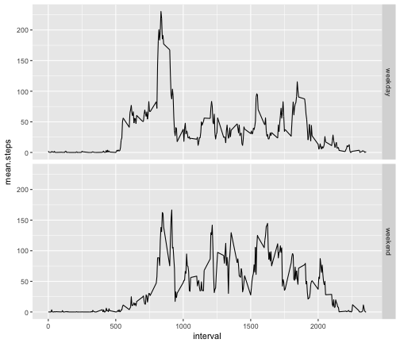

Reproducible Research: Peer Assessment 1
========================================


<hr><br>
<b>1. Loading and preprocessing the data</b>


```r
data <- read.csv("activity.csv", na.strings = "NA")
data$date <- as.Date(as.character(data$date), "%Y-%m-%d")
str(data)
```

```
## 'data.frame':	17568 obs. of  3 variables:
##  $ steps   : int  NA NA NA NA NA NA NA NA NA NA ...
##  $ date    : Date, format: "2012-10-01" "2012-10-01" ...
##  $ interval: int  0 5 10 15 20 25 30 35 40 45 ...
```
<br><hr><br>
<b>2. What is mean total number of steps taken per day?</b>  
2.1 Calculate the total number of steps taken per day

```r
daily.steps <- with(data, tapply(steps, date, sum, na.rm = TRUE))
head(as.data.frame(daily.steps),10)
```

```
##            daily.steps
## 2012-10-01           0
## 2012-10-02         126
## 2012-10-03       11352
## 2012-10-04       12116
## 2012-10-05       13294
## 2012-10-06       15420
## 2012-10-07       11015
## 2012-10-08           0
## 2012-10-09       12811
## 2012-10-10        9900
```
<br>
2.2 Make a histogram of the total number of steps taken each day

```r
library(ggplot2)
qplot(daily.steps, bins = 30)
```


<br><br>
2.3 Calculate and report the mean and median of the total number of steps taken per day

```r
summary(daily.steps)
```

```
##    Min. 1st Qu.  Median    Mean 3rd Qu.    Max. 
##       0    6778   10395    9354   12811   21194
```
<br><hr><br>
<b>3. What is the average daily activity pattern?</b>  
3.1 Make a time series plot of the 5-minute interval (x-axis) and the average number of steps taken, averaged across all days (y-axis)

```r
library(dplyr)
data <- group_by(data, interval)
data <- mutate(data, mean.steps = mean(steps, na.rm = TRUE))
qplot(interval, mean.steps, data=na.omit(data), geom = "line")
```


<br><br>
3.2 Which 5-minute interval, on average across all the days in the dataset, contains the maximum number of steps?

```r
subset(data[,3:4], mean.steps == max(mean.steps, na.rm = TRUE))[1,]
```

```
## # A tibble: 1 x 2
## # Groups:   interval [1]
##   interval mean.steps
##      <int>      <dbl>
## 1      835   206.1698
```
<br><hr><br>
<b>4. Imputing missing values </b>  
4.1 Calculate and report the total number of missing values in the dataset

```r
sum(is.na(data$steps))
```

```
## [1] 2304
```
<br>
4.2 Devise a strategy for filling in all of the missing values in the dataset.

```r
replaceNa <- function(x) {
        if (x<=400) {
                y <- data$steps[x:(x+800)] }
        else if (x>17168) {
                y <- data$steps[(x-800):x] } 
        else {
              y <- data$steps[(x-400):(x+400)] }
        
        return(trunc(mean(y, na.rm = TRUE)))
}
```
<br>
4.3 Create a new dataset that is equal to the original dataset but with the missing data filled in.

```r
# replace NA values with average of neighbouring 800 data
ind <- which(is.na(data$steps))
data$steps[ind] <- sapply(ind, replaceNa)
head(data)
```

```
## # A tibble: 6 x 4
## # Groups:   interval [6]
##   steps       date interval mean.steps
##   <dbl>     <date>    <int>      <dbl>
## 1    20 2012-10-01        0  1.7169811
## 2    20 2012-10-01        5  0.3396226
## 3    20 2012-10-01       10  0.1320755
## 4    20 2012-10-01       15  0.1509434
## 5    20 2012-10-01       20  0.0754717
## 6    20 2012-10-01       25  2.0943396
```
<br>
4.4 Make a histogram of the total number of steps taken each day. Calculate and report the mean and median total number of steps taken per day. Do these values differ from the estimates from the first part of the assignment? What is the impact of imputing missing data on the estimates of the total daily number of steps?

```r
daily.steps1 <- with(data, tapply(steps, date, sum, na.rm = TRUE))
qplot(daily.steps1, bins = 30)
```


```r
summary(daily.steps1)
```

```
##    Min. 1st Qu.  Median    Mean 3rd Qu.    Max. 
##      41    8476   10600   10476   12883   21194
```

Both the median and mean of the number of steps taken per day have increased with the imputting of missing data. The total number of steps have increased from 570608 to 639060.
<br><br><hr><br>
<b>5. Are there differences in activity patterns between weekdays and weekends? </b>  
5.1 Create a new factor variable in the dataset with two levels -- "weekday" and "weekend" indicating whether a given date is a weekday or weekend day.

```r
data$wday <- factor((weekdays(data$date) %in% c("Saturday","Sunday")), levels=c(FALSE, TRUE), labels=c("weekday", "weekend"))
```
<br>
5.2 Make a panel plot containing a time series plot of the 5-minute interval (x-axis) and the average number of steps taken, averaged across all weekday days or weekend days (y-axis)

```r
data <- group_by (data, wday, add = TRUE)
data <- mutate(data, mean.steps = mean(steps, na.rm = TRUE))
qplot(interval, mean.steps, data=na.omit(data), facets=wday~., geom = "line")
```


